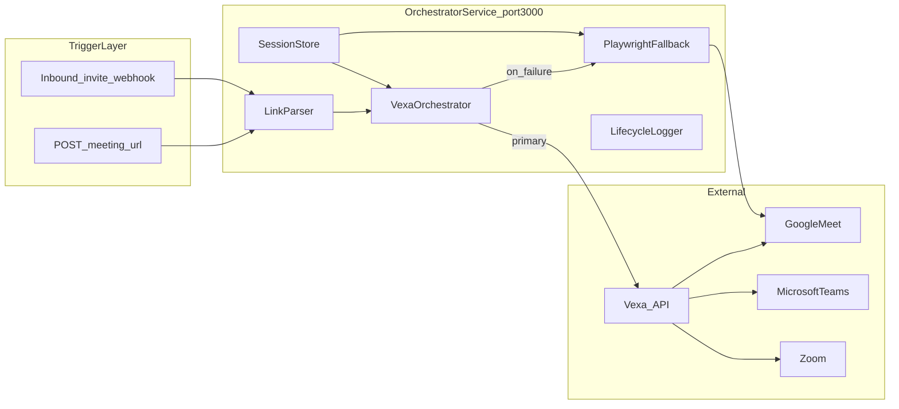

# Implementation TODO — Autonomous Meeting Bot

Actionable checklist to implement the system described in [PRD.md](PRD.md) and [docs/architecture.md](docs/architecture.md).

**Repository status:** Phases **0–3** implemented (Easy Mode + Vexa Cloud). Advanced Mode (Phase 4), Playwright fallback (Phase 5), and deployment hardening remain.

| Phase | Status | Notes |
|-------|--------|-------|
| **0** Foundation | Done | Fastify, TypeScript, Vitest, `GET /health`, env validation |
| **1** Parsers | Done | Meet + Teams URLs → `MeetingRef` + unit tests (Zoom removed) |
| **2** Vexa orchestrator | Done | `POST /bots`, poll until `active`, duplicate guard, `GET /meetings` lifecycle |
| **3** Easy Mode API + UI | Done | `/api/join`, `/api/status`, `/api/leave`, local UI at `/` |
| **4+** | Not started | Resend webhooks, Playwright fallback, production auth |

**Verified locally:** `npm test` (28 tests), `npm run build`, `npm run dev` → http://localhost:3000

---

## Status legend

| Symbol | Meaning |
|--------|---------|
| `- [ ]` | Not started |
| `- [x]` | Done |
| **Blocked by** | Must complete listed phase(s) first |
| **Acceptance** | How to verify the phase is complete |

---

## Architecture clarification

This repo implements the **orchestrator wrapper service**, not a fork of Vexa.

| Service | Default port / URL | Role |
|---------|-------------------|------|
| **This app** (orchestrator) | `http://localhost:3000` ([architecture](docs/architecture.md)) | Triggers, parsing, email webhooks, calls Vexa, Playwright fallback |
| **Vexa API** (external) | **Default:** `https://api.cloud.vexa.ai` · Self-hosted later: `http://localhost:8056` | Launches meeting bots, optional transcription/recording |



**PRD pipeline:** Trigger → Listener → Orchestrator → Meeting Bot → Meeting Platform ([PRD § Architecture](PRD.md#architecture))

---

## Chosen stack (defaults)

Copy [`.env.example`](.env.example) to `.env` and fill in secrets. Document setup steps in [docs/setup.md](docs/setup.md).

| Area | Choice | Notes |
|------|--------|-------|
| **Vexa** | **Cloud** (`https://api.cloud.vexa.ai`) | Required for bot joins. |
| **Email** | **Resend webhooks** | `RESEND_API_KEY` + `RESEND_WEBHOOK_SECRET` + public HTTPS URL for `/webhooks/resend`. |
| **Platforms** | **Google Meet** + **Teams** | Meet = assignment; Teams = reliable on Vexa Cloud. Zoom out of scope. Meet issues: [Vexa #407](https://github.com/Vexa-ai/vexa/issues/407). |

### Minimum env by mode

```bash
# Easy Mode (minimum)
VEXA_API_KEY=...

# Advanced Mode (webhook)
RESEND_API_KEY=...
RESEND_WEBHOOK_SECRET=whsec_...
BOT_EMAIL=you@your-id.resend.app
INVITE_SENDER_MODE=open
```

### Vexa (cloud → self-hosted later)

- [x] Vexa deployment model: **Cloud** for dev/MVP
- [ ] Copy `.env.example` → `.env`; set `VEXA_API_KEY` from [vexa.ai/account](https://vexa.ai/account) (never commit real keys)
- [ ] Confirm bot joins a Google Meet via cloud Vexa
- [ ] *(Later)* Switch `VEXA_API_BASE` to self-hosted URL — see [Self-Hosted Quickstart](https://docs.vexa.ai/getting-started)

### Inbound email (Resend)

- [x] Email provider: **Resend** (`email.received` webhook)
- [ ] Copy receiving address from Resend dashboard → `BOT_EMAIL`
- [ ] Set `RESEND_API_KEY`, `RESEND_WEBHOOK_SECRET` in `.env`
- [ ] Register HTTPS webhook URL in Resend → `/webhooks/resend`

---

## Target repository layout

Create incrementally per phase:

```
src/
  api/              # Fastify routes (Easy Mode)
  email/            # Webhook handler + invite parser (Advanced Mode)
  orchestrator/     # Join pipeline, idempotency, retries
  vexa/             # Vexa HTTP client + types
  playwright/       # Fallback joiners per platform
  auth/             # Session/cookie persistence
  parsers/          # URL → platform + native_meeting_id + passcode
  logging/          # Structured lifecycle events
  config/           # Env validation (zod)
tests/
docs/
  setup.md          # Env, Vexa, email, local dev
  runbook.md        # Failures, re-auth, ops
.env.example
```

**Stack (per PRD):** Node.js, TypeScript, Fastify, Vitest, Playwright (fallback only).

---

## Phase 0 — Project foundation

**Blocked by:** nothing  
**Acceptance:** `npm run build`, `npm test`, `npm run dev` start; `GET /health` returns 200.  
**Status:** Done (2026-06)

- [x] Initialize `package.json` with name, engines (Node 20+), `"type": "module"` if using ESM
- [x] Add TypeScript (`tsconfig.json`): strict mode, `src/` → `dist/`
- [x] Add dev tooling: ESLint, Vitest
- [x] Scripts: `dev`, `build`, `start`, `test`, `typecheck`, `lint`
- [x] Create `src/index.ts` — bootstrap Fastify server on `PORT` (default `3000`)
- [x] Implement `GET /health` → `{ "status": "ok" }`
- [x] Add `src/config/env.ts` — validate required env with Zod; fail fast on boot
- [x] Create [`.env.example`](.env.example) (Vexa Cloud + Resend defaults — see **Chosen stack** above)
- [ ] Copy `.env.example` → `.env` and fill in secrets locally *(operator task)*

- [x] Add `data/` and `logs/` to `.gitignore` if not already covered
- [x] [docs/bot-email-and-deployment.md](docs/bot-email-and-deployment.md) — bot email, Resend, Render (plain-language guide)
- [x] [docs/setup.md](docs/setup.md) — step-by-step setup (link to bot-email doc for concepts)
- [x] Update [README.md](README.md) with one-paragraph overview + link to this TODO and `docs/setup.md`

---

## Phase 1 — Domain model and link parsing

**Blocked by:** Phase 0  
**Acceptance:** Parser unit tests pass for Meet and Teams fixture URLs; invalid URLs throw typed errors.  
**Status:** Done (2026-06)

- [x] Add `src/parsers/types.ts`:
  - `Platform`: `google_meet` | `teams`
  - `MeetingRef`: `{ platform, native_meeting_id, passcode?, sourceUrl? }`
  - `JoinRequest`, `JoinResult`, `BotLifecycleEvent` enums/types (+ `awaiting_admission` join status)
- [x] Implement `parseMeetingUrl(url: string): MeetingRef` in `src/parsers/meeting-url.ts`
- [x] **Google Meet:** `meet.google.com/{code}` → `google_meet` + hyphenated code ([Vexa Bots API — Meet](https://docs.vexa.ai/api/bots))
- [x] **Microsoft Teams:** extract numeric meeting ID from URL; extract `?p=` as `passcode` when present
- [x] Reject unknown hosts, empty IDs, and malformed URLs with `ParseError` (include `code` + `message`)
- [x] Reject Zoom URLs (out of project scope)
- [x] Add `tests/parsers/meeting-url.test.ts` with fixtures:
  - [x] Valid Meet URL
  - [x] Valid Teams URL with passcode
  - [x] Invalid / unsupported URL
- [x] Export parser from `src/parsers/index.ts`

---

## Phase 2 — Vexa orchestrator (primary path)

**Blocked by:** Phase 1  
**Acceptance:** Given a `MeetingRef`, service calls Vexa `POST /bots` and can report running status; duplicate join for same meeting is prevented while bot is active.  
**Status:** Done (2026-06) — uses **Vexa Cloud**; meeting lifecycle from `GET /meetings` (`active`, `awaiting_admission`, …), not container `Up` alone.

- [x] Add `src/vexa/types.ts` — request/response shapes aligned with [Bots API](https://docs.vexa.ai/api/bots)
- [x] Implement `src/vexa/client.ts`:
  - [x] `createBot(meeting: MeetingRef, options?)` → `POST /bots` with `X-API-Key`
  - [x] `listRunningBots()` → `GET /bots/status`
  - [x] `stopBot(meeting: MeetingRef)` → `DELETE /bots/{platform}/{native_meeting_id}`
  - [x] `findMeeting(meeting)` → `GET /meetings` (lifecycle status)
- [x] Map `MeetingRef` → Vexa body:
  - [x] `platform`, `native_meeting_id`, optional `passcode`
  - [x] v1 defaults: `transcribe_enabled: false`, `recording_enabled` from env (PRD non-goals: no AI summaries in v1)
  - [x] Optional `bot_name` from `BOT_DISPLAY_NAME`
- [x] Implement `src/orchestrator/join.ts`:
  - [x] Check running bots — skip duplicate `platform` + `native_meeting_id` unless `force` flag
  - [x] Call `VexaClient.createBot`
  - [x] Poll until meeting `active` or timeout (`VEXA_JOIN_POLL_INTERVAL_MS`, `VEXA_JOIN_TIMEOUT_MS` in `.env.example`)
- [x] `src/vexa/status.ts` — `resolveJoinStatus`, `mapVexaMeetingStatus`, container vs lifecycle mapping
- [x] Error taxonomy + logging hooks: `vexa_4xx`, lifecycle events via `src/logging/logger.ts`
- [x] Integration tests with mocked `fetch` (orchestrator + API)
- [ ] Manual smoke: join a real **Google Meet** with **Vexa Cloud** *(operator checklist)*

---

## Phase 3 — Easy Mode API

**Blocked by:** Phase 2  
**Acceptance:** `POST /api/join` with a meeting URL triggers bot join; status/leave endpoints work; local UI at `/` for dev.  
**Status:** Done (2026-06) — API key auth **deferred** until Render deploy (local dev open).

- [ ] Add API key middleware (`API_KEY` env) — *deferred for production; see Phase 9*
- [x] `POST /api/join`
  - [x] Body: `{ meetingUrl: string, botName?: string, force?: boolean }`
  - [x] Validate with Zod
  - [x] Flow: parse URL → `orchestrator.join` → response `{ success, meetingRef, status, correlationId }`
- [x] `GET /api/status/:platform/:nativeMeetingId` — meeting lifecycle + container state
- [x] `POST /api/leave` — body with `meetingUrl` or platform + id → `stopBot`
- [x] Consistent error responses: `{ success: false, error: { code, message } }`
- [x] Register routes in `src/api/routes.ts`; static UI via `public/` + `@fastify/static`
- [x] Easy Mode UI at `http://localhost:3000` — join form, auto status poll, leave
- [x] Add `tests/api/join.test.ts` + `tests/ui.test.ts` (mock orchestrator)
- [x] Document Easy Mode in [docs/setup.md](docs/setup.md) with `curl` + UI steps

---

## Phase 4 — Advanced Mode (email listener)

**Blocked by:** Phase 3 (reuse same `orchestrator.join`)  
**Acceptance:** Sending a calendar invite with a Meet link to the bot inbox results in automatic join without calling `/api/join`.

### 4a — Resend webhook infrastructure

- [ ] Resend receiving address or custom domain MX
- [ ] `POST /webhooks/resend` — verify signature with `RESEND_WEBHOOK_SECRET`
- [ ] Handle `email.received` — fetch body via `resend.emails.receiving.get()` (`RESEND_API_KEY`)
- [ ] Register public HTTPS URL in Resend (tunnel for local dev)

### 4b — Security (required)

- [ ] `src/email/sender-allowlist.ts` — `isSenderAllowed(from)` using env:
  - [ ] `INVITE_SENDER_MODE=strict` — only `ALLOWED_INVITE_SENDERS` (exact match)
  - [ ] `INVITE_SENDER_MODE=domain` — any `@ALLOWED_INVITE_DOMAINS` + `ALLOWED_INVITE_SENDERS`
  - [ ] `INVITE_SENDER_MODE=open` — allow all (log warning; dev only)
- [ ] Parse `From` header formats (`user@domain.com`, `Name <user@domain.com>`)
- [ ] Reject auto-replies (`Auto-Submitted`, `X-Auto-Response-Suppress`)
- [ ] Rate limit joins per sender / per hour
- [ ] Never treat email body as instructions — only extract meeting links
- [ ] Log and drop emails that fail validation

### 4c — Invite extraction and join

- [ ] `src/email/invite-extractor.ts` — parse HTML/plain + ICS for Meet/Teams/Zoom URLs
- [ ] Reuse `parseMeetingUrl` on extracted links
- [ ] Dedup store: `message-id` / calendar UID → skip if already processed
- [ ] On success: call `orchestrator.join` with `trigger: "email"` and correlation ID
- [ ] Unit tests: sample invite HTML/ICS fixtures
- [ ] E2E manual checklist in `docs/setup.md`: invite bot email → verify join

---

## Phase 5 — Playwright fallback engine

**Blocked by:** Phase 2 (orchestrator must define when to fallback)  
**Acceptance:** When Vexa join fails with configured retriable errors, fallback joins Meet (minimum); failures produce screenshot + structured log.

- [ ] `src/playwright/config.ts` — `HEADLESS`, timeouts, `PLAYWRIGHT_SESSION_DIR`
- [ ] `src/playwright/session.ts` — load/save `storageState` per platform account
- [ ] `src/playwright/join-google-meet.ts` — open URL, name prompt, waiting room / ask to join
- [ ] `src/playwright/join-teams.ts` — Teams web join flow (if in v1 scope; else document as Phase 5b)
- [x] Zoom — removed from scope (not required by assignment)
- [ ] Wire fallback in `orchestrator.join` only when `FALLBACK_ENABLED=true` and error matches retriable matrix
- [ ] Capture screenshot on failure to `logs/screenshots/`
- [ ] Document retriable vs fatal errors in [docs/runbook.md](docs/runbook.md)
- [ ] Manual test: simulate Vexa down → fallback joins Meet

---

## Phase 6 — Authentication and session persistence

**Blocked by:** Phase 2 (Vexa path) and Phase 5 (Playwright path)  
**Acceptance:** After one-time login, bot joins authenticated meetings across process restarts without manual login.

### Path A — Vexa-managed sessions *(when self-hosting Vexa later)*

- [ ] Document Vexa [authenticated-meetings / browser-session](https://github.com/Vexa-ai/vexa/tree/main/features) setup in `docs/setup.md`
- [ ] Orchestrator passes only `MeetingRef`; no local Google cookies required when Vexa handles auth
- [ ] Verify join to a meeting that requires org login after migrating off cloud

### Path B — Playwright `storageState` *(default for cloud Vexa MVP)*

- [ ] `src/auth/session-store.ts` — read/write encrypted session files under `PLAYWRIGHT_SESSION_DIR`
- [ ] CLI script `npm run auth:google` — headed browser, user logs in once, save state
- [ ] Optional: `auth:microsoft` for Teams
- [ ] Document rotation and re-auth in `docs/runbook.md`
- [ ] Ensure `data/sessions/` is gitignored and never committed

- [x] Auth approach for MVP: **Path B** (Playwright sessions); revisit **Path A** when switching to self-hosted Vexa

---

## Phase 7 — Observability and reliability

**Blocked by:** Phase 3 (minimum); extend through Phases 4–5  
**Acceptance:** Every join attempt has a correlation ID traceable through logs; SIGTERM attempts graceful bot stop.

- [x] `src/logging/logger.ts` — structured JSON (pino)
- [x] Lifecycle events (include `correlationId`, `platform`, `native_meeting_id`):
  - [x] `trigger_received` (`source`: `api` | `email`)
  - [x] `link_parsed`
  - [x] `vexa_bot_requested`
  - [x] `vexa_status`
  - [ ] `fallback_started`
  - [x] `join_succeeded`
  - [x] `join_failed`
- [x] Propagate correlation ID from API header `X-Correlation-Id` or generate UUID
- [ ] `SIGTERM` / `SIGINT` handler — call `stopBot` for active sessions where possible
- [ ] Optional: simple counters in logs for joins succeeded/failed (no dashboard in v1)

---

## Phase 8 — Testing and quality

**Blocked by:** Phases 1–3 minimum  
**Acceptance:** CI runs lint + test on every PR; coverage on parsers and orchestrator core.

- [x] Unit tests: parsers, env config
- [x] Integration: orchestrator + mocked Vexa HTTP
- [x] API route tests with injected mocks
- [ ] Unit tests: invite extractor *(Phase 4)*
- [ ] Add GitHub Actions (or equivalent) workflow: `lint`, `typecheck`, `test`
- [ ] E2E manual checklist (document only, not necessarily automated):
  - [ ] Easy Mode: Meet URL join
  - [ ] Easy Mode: Teams URL with passcode
  - [ ] Advanced Mode: email invite → auto join
  - [ ] Fallback: Vexa failure → Playwright join
  - [ ] Session persistence across restart

---

## Phase 9 — Deployment and operations

**Blocked by:** Phases 0–7 stable locally  
**Acceptance:** Service deployable with env vars; HTTPS webhook URL registered in Resend; runbook covers top failures.

- [ ] `Dockerfile` — multi-stage build, run as non-root
- [ ] Optional `docker-compose.yml` — orchestrator + note linking to external Vexa stack
- [ ] Deploy env checklist:
  - [ ] `PORT` bound correctly (Render/web services expect `$PORT`)
  - [ ] Secrets in platform vault (not `.env` in image)
  - [ ] HTTPS URL for email webhooks
  - [ ] DNS for bot inbox — Resend MX on `centralagent.ai`
- [ ] Health check path for load balancer: `/health`
- [ ] Write [docs/runbook.md](docs/runbook.md):
  - [ ] Waiting room / admit bot manually
  - [ ] Expired or invalid invite link
  - [ ] Vexa API down — fallback behavior
  - [ ] Re-authentication steps
  - [ ] Duplicate join / stuck bot cleanup

---

## Phase 10 — Documentation

**Blocked by:** Can run in parallel; finalize when features land  
**Acceptance:** New developer can follow `docs/setup.md` and join a meeting in < 1 hour.

- [ ] Expand [docs/architecture.md](docs/architecture.md):
  - [ ] Component boundaries (trigger / listener / orchestrator / bot engine)
  - [ ] Sequence diagram: Easy Mode flow
  - [ ] Sequence diagram: Advanced Mode flow
  - [ ] Port clarification (this app `3000` vs Vexa `8056` / cloud)
- [ ] Complete [docs/setup.md](docs/setup.md) — prerequisites, Vexa, email, tunnels, env vars
- [ ] Complete [docs/runbook.md](docs/runbook.md) — operations and failure recovery
- [ ] [README.md](README.md) — quickstart (`cp .env.example .env`, `npm run dev`, sample `curl`)
- [ ] Keep product truth in [PRD.md](PRD.md); keep engineering tasks in this file

---

## Explicitly out of scope (v1)

Do not implement these until PRD / stakeholders expand scope:

- AI meeting summaries, analytics, or “CentralAgent Brain” transcript pipeline ([architecture](docs/architecture.md) future arrow only)
- Admin dashboard / full UI ([PRD Non-Goals](PRD.md#non-goals))
- Real-time collaboration tools
- Multi-bot fleet scaling, calendar sync, billing ([PRD Future Enhancements](PRD.md#future-enhancements))

---

## Definition of done (PRD success criteria)

| PRD criterion | Source | Verification |
|---------------|--------|--------------|
| Successful joins from URL triggers | [PRD Success Criteria](PRD.md#success-criteria) | `POST /api/join` with real Meet or Teams URL; bot appears in meeting |
| Successful joins from email invites | [PRD Success Criteria](PRD.md#success-criteria) | Organizer invites `BOT_EMAIL`; bot joins without manual `/api/join` |
| No repeated manual login | [PRD Goals](PRD.md#goals) | Restart orchestrator (+ Vexa/Playwright); join authenticated meeting without interactive login |
| Reliable event detection | [PRD Success Criteria](PRD.md#success-criteria) | Webhook delivered once; dedup prevents double join; logs show `trigger_received` |
| Recoverable / logged failures | [PRD Success Criteria](PRD.md#success-criteria) | Induced failure (bad URL, Vexa down) → structured `join_failed` + runbook recovery step |

---

## External references

| Topic | Link |
|-------|------|
| Product requirements | [PRD.md](PRD.md) |
| System diagram | [docs/architecture.md](docs/architecture.md) |
| Vexa API overview | https://docs.vexa.ai/user_api_guide |
| Vexa Bots API | https://docs.vexa.ai/api/bots |
| Vexa self-hosted | https://docs.vexa.ai/getting-started |
| Vexa GitHub | https://github.com/Vexa-ai/vexa |
| Resend inbound email | https://resend.com/docs/dashboard/receiving/introduction |

---

## Suggested implementation order

1. ~~Phases **0 → 1 → 2 → 3** — Easy Mode with **Vexa Cloud** (Google Meet first)~~ **Done**
2. Phase **6 Path B** — Playwright sessions if joins require login on cloud
3. Phase **4** — Advanced Mode via **Resend** → `bot@centralagent.ai`
4. Phase **5** — Playwright fallback when Vexa join fails
5. Phases **7 → 8 → 9 → 10** — harden, deploy, document
6. *(Later)* Self-hosted Vexa + Path A auth if needed

Track progress by checking boxes above. When a phase is complete, note the date and environment (local / staging / prod) in your team’s workflow or changelog.
