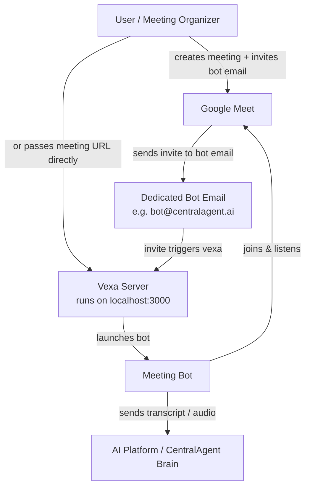

# Architecture Diagram

```mermaid
graph TD
    A[User / Meeting Organizer] -->|creates meeting + invites bot email| B[Google Meet]
    A -->|or passes meeting URL directly| C[Vexa Server<br/>runs on localhost:3000]
    D[Dedicated Bot Email<br/>e.g. bot@centralagent.ai] -->|invite triggers vexa| C
    B -->|sends invite to bot email| D
    C -->|launches bot| E[Meeting Bot]
    E -->|joins & listens| B
    E -->|sends transcript / audio| F[AI Platform / CentralAgent Brain]
```
