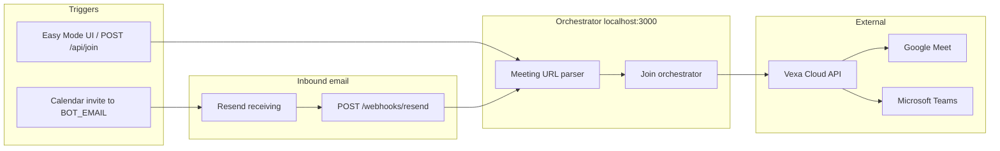

# Architecture

Plain-language email and webhook setup: [bot-email-and-deployment.md](bot-email-and-deployment.md).  
Local dev: [setup.md](setup.md).

## System overview



## Modes

| Mode | Trigger | Needs Resend / ngrok |
|------|---------|----------------------|
| **Easy** | Paste Meet/Teams URL | No |
| **Advanced** | Invite `BOT_EMAIL` | Yes (webhook + public HTTPS) |

## Source layout

```
src/
  api/           # POST /api/join, status, leave
  webhooks/      # POST /webhooks/resend
  email/         # Invite parsing, Resend client, processor
  orchestrator/  # Vexa join pipeline
  vexa/          # Vexa HTTP client
  parsers/       # URL → MeetingRef
  config/        # Env validation
  logging/
public/          # Easy Mode UI
```
