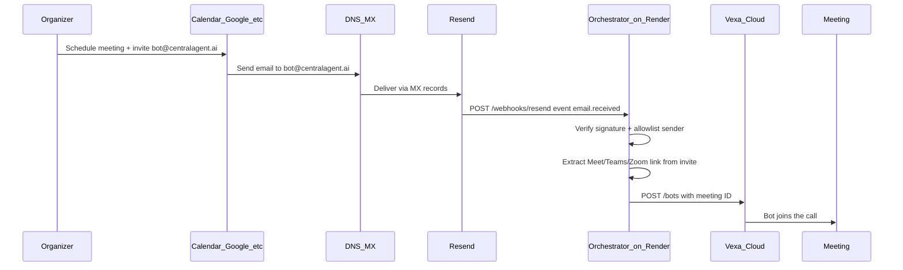
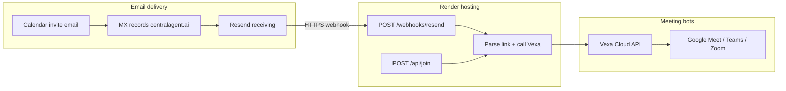

# Bot Email, Resend, and Render — How It Works

This guide explains how **`bot@centralagent.ai`** triggers automatic meeting joins, and how **Render** fits in. No prior knowledge of the codebase is required.

For the high-level product diagram, see [architecture.md](architecture.md). For implementation tasks, see [TODO.md](../TODO.md).

---

## What problem this solves

Organizers usually have two ways to get a bot into a meeting:

1. **Easy Mode** — Paste a meeting URL into an API (`POST /api/join`).
2. **Advanced Mode** — Add the bot’s email as a calendar guest; the bot joins when the invite arrives.

Advanced Mode is what this document focuses on.

---

## What `bot@centralagent.ai` actually is

`bot@centralagent.ai` is **not** a Gmail inbox you log into.

It is a **dedicated email address** that:

- Appears on calendar invites like any other guest
- Receives `.ics` calendar files and meeting links in email
- Is handled **programmatically** by our backend — never by a human reading mail

The address is configured in `.env` as `BOT_EMAIL`. Organizers invite exactly that address when scheduling Google Meet, Teams, or Zoom calls.

---

## The three services involved

| Service | What it does | Analogy |
|---------|----------------|---------|
| **Resend** | Receives email for your domain and notifies your app | The mailroom |
| **Render** | Runs your orchestrator app 24/7 on a public HTTPS URL | The server that reacts to mail |
| **Vexa Cloud** | Launches the actual meeting bot into Meet/Teams/Zoom | The robot that joins the call |

**Important:** Render does **not** receive email. Only Resend receives mail. Render only receives **webhooks** (HTTP callbacks) from Resend.

---

## End-to-end flow (Advanced Mode)



### Step by step

1. **Organizer** creates a Google Meet (or other platform) and adds `bot@centralagent.ai` as a guest.
2. **Calendar** sends an invite email to that address.
3. **DNS (MX records)** for `centralagent.ai` tell the internet: “deliver mail for this domain to Resend.”
4. **Resend** accepts the message and immediately sends an HTTP POST to your app — a **webhook** — saying “email received.”
5. **Orchestrator on Render** (this repo’s app):
   - Verifies the webhook is really from Resend (`RESEND_WEBHOOK_SECRET`)
   - Checks the sender is on your allowlist (`ALLOWED_INVITE_SENDERS`)
   - Parses the email body / calendar attachment for a meeting link
   - Calls **Vexa Cloud** to send a bot to that meeting
6. **Vexa** runs the bot; it appears in the meeting like a normal participant.

---

## How Render connects (and what it does not do)

When you deploy this project to [Render](https://render.com) as a **Web Service**, you get a URL such as:

```text
https://central-agent-meeting-bot.onrender.com
```

Render’s job:

- Keep the Node.js orchestrator running
- Expose HTTPS endpoints:
  - `GET /health` — health check
  - `POST /api/join` — Easy Mode (URL trigger)
  - `POST /webhooks/resend` — Advanced Mode (email trigger)
- Inject environment variables from the Render dashboard (API keys, secrets)

You register the webhook URL in **Resend’s dashboard** (or via their API):

```text
https://central-agent-meeting-bot.onrender.com/webhooks/resend
```



Render is **never** in the SMTP/email path. It only receives HTTP requests after Resend has already received the mail.

---

## Easy Mode vs Advanced Mode

| | Easy Mode | Advanced Mode |
|---|-----------|---------------|
| **Trigger** | HTTP API with meeting URL | Calendar invite to `bot@centralagent.ai` |
| **Who initiates** | Developer, script, or internal tool | Meeting organizer |
| **Render endpoint** | `POST /api/join` | `POST /webhooks/resend` |
| **Resend required?** | No | Yes |
| **Same join logic?** | Yes — both end up calling Vexa | Yes |

---

## Environment variables (what each one is for)

Copy [`.env.example`](../.env.example) to `.env` locally, or set the same keys in Render’s **Environment** tab for production.

| Variable | Purpose |
|----------|---------|
| `BOT_EMAIL` | Address organizers invite (e.g. `bot@centralagent.ai`) |
| `RESEND_API_KEY` | Fetch full email content from Resend after webhook fires |
| `RESEND_WEBHOOK_SECRET` | Cryptographically verify webhooks are from Resend |
| `ALLOWED_INVITE_SENDERS` | Comma-separated emails allowed to trigger joins (security) |
| `VEXA_API_BASE` | Vexa API URL (`https://api.cloud.vexa.ai` for cloud) |
| `VEXA_API_KEY` | Authenticate with Vexa to launch bots |
| `API_KEY` | Protect your `/api/*` routes from unauthorized use |
| `BOT_DISPLAY_NAME` | Name shown for the bot inside the meeting |

Never commit real secrets to git. `.env` is gitignored.

---

## Security basics

Email to an agent inbox is **untrusted input**. The orchestrator must:

1. **Verify** every Resend webhook signature before processing
2. **Allowlist** senders — only `ALLOWED_INVITE_SENDERS` can trigger a join
3. **Ignore** auto-replies and out-of-office messages
4. **Extract only meeting links** — never treat email body text as commands or instructions
5. **Dedupe** invites so the same calendar event does not spawn multiple bots

---

## Local development vs production

### Production (Render + Resend)

1. Deploy orchestrator to Render (HTTPS URL).
2. Configure MX records on your domain → Resend.
3. Create Resend webhook pointing to `https://your-app.onrender.com/webhooks/resend`.
4. Set all env vars on Render.

### Local development

Resend cannot POST to `http://localhost:3000` directly. Options:

- Use a **tunnel** (ngrok, Tailscale Funnel) and point the Resend webhook at the tunnel URL temporarily
- Test **Easy Mode** locally (`POST /api/join`) without email
- Deploy to a Render **preview/staging** service for email integration tests

---

## DNS setup (high level)

For mail to reach Resend for `@centralagent.ai`, your domain registrar or DNS provider needs **MX records** pointing to Resend’s receiving servers. Exact values come from the [Resend receiving docs](https://resend.com/docs/dashboard/receiving/introduction) when you add the domain in the Resend dashboard.

Until MX is configured, invites to `bot@centralagent.ai` will not be delivered.

---

## Setup checklist

Use this when onboarding a new environment:

- [ ] Vexa Cloud account and API key ([vexa.ai/account](https://vexa.ai/account))
- [ ] Resend account and API key
- [ ] Domain added in Resend; MX records live for `centralagent.ai`
- [ ] Orchestrator deployed on Render with env vars set
- [ ] Resend webhook URL → `https://<your-render-app>/webhooks/resend`
- [ ] `ALLOWED_INVITE_SENDERS` lists trusted organizer emails
- [ ] Smoke test: invite `bot@centralagent.ai` to a test Meet → bot joins

Implementation details and code tasks live in [TODO.md](../TODO.md) (Phases 0, 3, 4, 9).

---

## Common questions

**Does the bot read my whole inbox?**  
No. Only emails delivered to `bot@centralagent.ai` via Resend, and only after passing sender allowlist checks.

**Why not use Gmail for the bot address?**  
You could, but Resend is built for programmatic inbound mail with instant webhooks. Gmail would require OAuth, polling, and more custom security work for the same outcome.

**Why Render?**  
Render provides a always-on HTTPS URL for webhooks and a simple way to run the Node orchestrator. Any host with a public HTTPS endpoint works the same way (Vercel, Fly.io, etc.) — Render is the planned deployment target for this project.

**What if Vexa fails to join?**  
The orchestrator can fall back to Playwright browser automation (see [TODO.md](../TODO.md) Phase 5). That is separate from the email path.

**Is transcript / AI processing included?**  
Not in v1. The [architecture diagram](architecture.md) shows a future path to CentralAgent Brain; that is out of scope for the first release per [PRD.md](../PRD.md).

---

## Related docs

- [architecture.md](architecture.md) — System diagram
- [PRD.md](../PRD.md) — Product requirements
- [TODO.md](../TODO.md) — Implementation checklist
- [Resend inbound email](https://resend.com/docs/dashboard/receiving/introduction)
- [Vexa Bots API](https://docs.vexa.ai/api/bots)
