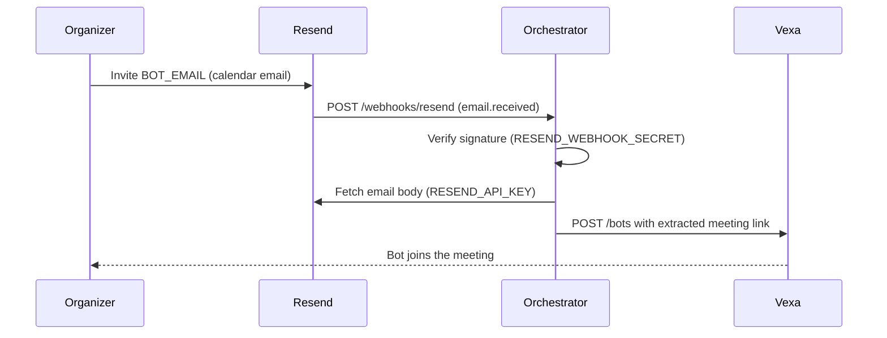

# Bot Email and Resend — How It Works

How the bot inbox triggers automatic meeting joins (Advanced Mode).

For the system diagram see [architecture.md](architecture.md); for local dev see [setup.md](setup.md).

---

## The bot email address

`BOT_EMAIL` is **not** a mailbox you log into. It is a dedicated address that appears on
calendar invites like any other guest, receives the `.ics` / meeting link, and is handled
programmatically by the orchestrator.

- Resend-managed: `anything@your-id.resend.app` (Resend dashboard → Receiving)
- Custom domain: `bot@bot.yourdomain.com` (requires an MX record)

---

## End-to-end flow

Easy Mode skips all of this — it calls Vexa directly from `POST /api/join` (no Resend, no
public URL). Both modes share the same join logic.

---

## Webhook secret (`RESEND_WEBHOOK_SECRET`)

Your `/webhooks/resend` endpoint is public, so each request is verified against the secret
(`whsec_...`) to prove it came from Resend. Unverified requests are rejected.

Create the webhook in the [Resend dashboard](https://resend.com/webhooks) with event
`email.received`; Resend shows the signing secret **once** — save it to `.env`. If lost,
delete the webhook and create a new one.

The webhook needs a **public HTTPS URL**. For local dev, tunnel with ngrok — see
[setup.md → ngrok](setup.md#ngrok-for-advanced-mode). Any HTTPS host works the same.

---

## Custom domain inbox (optional)

To use your own address instead of `@…resend.app`:

1. [Resend → Domains](https://resend.com/domains) → add a domain (prefer a **subdomain**
   like `bot.yourdomain.com` if the root already uses Google/Microsoft mail).
2. Add the **MX** record Resend shows (lowest priority among MX records on that host).
3. Wait until Resend marks **receiving** as verified.
4. Set `BOT_EMAIL=anything@bot.yourdomain.com` and use it on invites.

Details: [Resend receiving docs](https://resend.com/docs/dashboard/receiving/introduction).

---

## Security model

The orchestrator already enforces these on inbound mail:

1. Verifies every webhook signature with `RESEND_WEBHOOK_SECRET`
2. Ignores auto-replies (`Auto-Submitted`, `X-Auto-Response-Suppress`)
3. Extracts only meeting links — never treats the email body as commands
4. Dedupes processed `email_id`s to prevent double joins
5. Rate-limits joins per sender via `EMAIL_JOIN_RATE_LIMIT_PER_HOUR`

---

## FAQ

**Does the bot read a full personal inbox?** No — only mail sent to `BOT_EMAIL` via Resend.

**Do I need the secret for Easy Mode?** No. Easy Mode uses `POST /api/join` or the UI.

**What if Vexa fails to join?** A Playwright fallback joins Google Meet directly — see
[setup.md](setup.md#playwright-fallback-google-meet).

**Transcripts / AI processing?** Not in v1 ([PRD.md](../PRD.md)).

---

## Related

- [setup.md](setup.md) · [architecture.md](architecture.md) · [PRD.md](../PRD.md)
- [Resend inbound email](https://resend.com/docs/dashboard/receiving/introduction) · [Vexa Bots API](https://docs.vexa.ai/api/bots)
