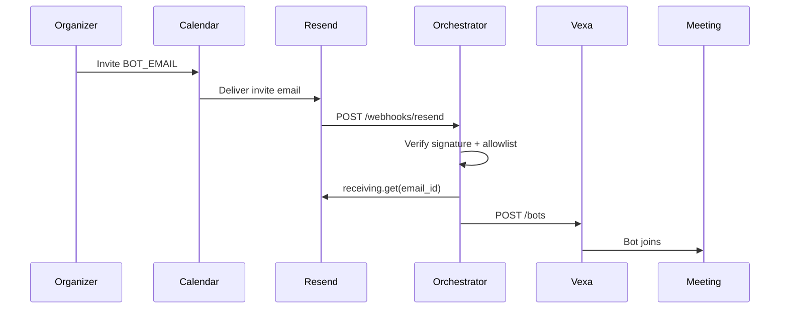
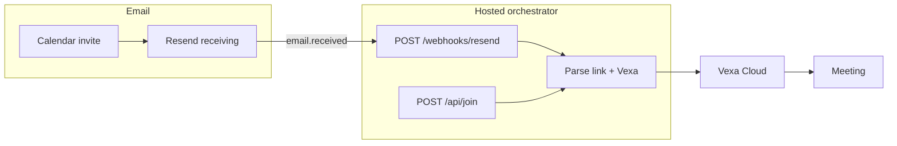

# Bot Email, Resend, and Render — How It Works

This guide explains how the bot inbox triggers automatic meeting joins, and how **Resend** and **Render** fit in. No prior knowledge of the codebase is required.

For the high-level product diagram, see [architecture.md](architecture.md). For implementation tasks, see [TODO.md](../TODO.md).

---

## What problem this solves

Organizers have two ways to get a bot into a meeting:

1. **Easy Mode** — Submit a meeting URL via API (`POST /api/join`).
2. **Advanced Mode** — Add the bot’s email as a calendar guest; the bot joins when the invite arrives.

Advanced Mode uses **Resend webhooks**: when mail arrives, Resend POSTs to your app immediately.

---

## What the bot email address is

The bot inbox (configured as `BOT_EMAIL` in `.env`) is **not** a Gmail inbox you log into.

It is a **dedicated address** that:

- Appears on calendar invites like any other guest
- Receives `.ics` files and meeting links
- Is handled **programmatically** by the orchestrator

Examples:

- Resend-managed: `anything@your-id.resend.app` (from Resend dashboard → Receiving)
- Custom domain: `bot@centralagent.ai` (requires MX records)

---

## The services involved

| Service | Role |
|---------|------|
| **Resend** | Receives inbound email and sends `email.received` webhooks |
| **Orchestrator** (this app) | Handles webhooks, parses invites, calls Vexa |
| **Render** (or any host) | Runs the orchestrator on a public HTTPS URL |
| **Vexa Cloud** | Launches the meeting bot into Meet or Teams |

Render does **not** receive email. Resend receives mail, then POSTs to your orchestrator’s webhook endpoint.

---

## Easy Mode vs Advanced Mode

| | Easy Mode | Advanced Mode |
|---|-----------|---------------|
| **Trigger** | HTTP API with meeting URL | Calendar invite to `BOT_EMAIL` |
| **Resend required?** | No | Yes (`RESEND_API_KEY` + webhook) |
| **Public HTTPS URL required?** | No | Yes (for `/webhooks/resend`) |
| **Join logic** | Same — both call Vexa | Same |

Easy Mode minimum env: `VEXA_API_KEY`, `API_KEY`, `VEXA_API_BASE`.

```bash
curl -X POST http://localhost:3000/api/join \
  -H "X-API-Key: your-api-key" \
  -H "Content-Type: application/json" \
  -d '{"meetingUrl":"https://meet.google.com/abc-defg-hij"}'
```

Advanced Mode additionally needs: `RESEND_API_KEY`, `RESEND_WEBHOOK_SECRET`, and a registered webhook URL.

---

## End-to-end flow (Advanced Mode)



### Step by step

1. Organizer invites `BOT_EMAIL` on a calendar event with a Meet or Teams link.
2. Mail is delivered to Resend (via `@xxx.resend.app` or custom domain MX).
3. Resend POSTs an `email.received` event to `https://your-host/webhooks/resend`.
4. Orchestrator verifies the webhook signature (`RESEND_WEBHOOK_SECRET`).
5. Orchestrator checks the sender against `INVITE_SENDER_MODE` allowlist.
6. Orchestrator fetches full email content via `RESEND_API_KEY` and extracts the meeting link.
7. Orchestrator calls Vexa; the bot joins the meeting.

---

## Webhook endpoint URL

Resend needs a **public HTTPS URL** to deliver events, for example:

```text
https://your-app.onrender.com/webhooks/resend
```

| Without registered URL | With registered URL |
|------------------------|---------------------|
| Resend receives the invite | Same |
| Your app is not notified | Resend POSTs `email.received` |
| Bot does not auto-join | App parses invite and calls Vexa |

Register in Resend → Webhooks, or via `POST https://api.resend.com/webhooks`.

For local development, expose your app with a tunnel (ngrok, Tailscale Funnel) and register that URL with Resend.

---

## Webhook secret (`RESEND_WEBHOOK_SECRET`)

| Mode | Need secret? |
|------|--------------|
| Easy Mode only | No |
| Advanced Mode (webhook) | Yes |

Your webhook endpoint is public. The secret (`whsec_...`) verifies each request came from Resend:

```text
Resend signs request → app verifies with RESEND_WEBHOOK_SECRET → process or reject
```

Without verification, anyone could POST fake events and try to trigger bot joins.

**How to get it:** Create a webhook in the [Resend dashboard](https://resend.com/webhooks) or via API. Resend returns `signing_secret` **once** — save it to `.env`. If lost, delete the webhook and create a new one.

---

## Invite sender allowlist

Control who can trigger a join by email via `INVITE_SENDER_MODE`:

| Mode | Config | Who can trigger a join |
|------|--------|------------------------|
| **strict** | `ALLOWED_INVITE_SENDERS` | Listed exact emails only |
| **domain** | `ALLOWED_INVITE_DOMAINS` + optional `ALLOWED_INVITE_SENDERS` | Anyone at listed domains, plus extra emails |
| **open** | — | Anyone who invites the bot |

### Examples

```bash
# Specific organizers only
INVITE_SENDER_MODE=strict
ALLOWED_INVITE_SENDERS=alice@yourcompany.com,bob@yourcompany.com

# Anyone at your organization
INVITE_SENDER_MODE=domain
ALLOWED_INVITE_DOMAINS=yourcompany.com

# Organization + one external partner
INVITE_SENDER_MODE=domain
ALLOWED_INVITE_DOMAINS=yourcompany.com
ALLOWED_INVITE_SENDERS=partner@gmail.com

# No sender restrictions
INVITE_SENDER_MODE=open
```

With `open`, any sender who knows `BOT_EMAIL` can trigger a join. Prefer `strict` or `domain` when the bot address is widely known.

Implementation: `src/email/sender-allowlist.ts` (TODO Phase 4).

---

## Environment variables

Copy [`.env.example`](../.env.example) to `.env`, or set the same keys on your host (e.g. Render **Environment** tab).

| Variable | Purpose |
|----------|---------|
| `BOT_EMAIL` | Address organizers invite |
| `RESEND_API_KEY` | Fetch received email content after webhook fires |
| `RESEND_WEBHOOK_SECRET` | Verify `email.received` webhook signatures |
| `INVITE_SENDER_MODE` | `strict` \| `domain` \| `open` |
| `ALLOWED_INVITE_SENDERS` | Exact emails for `strict` or extras in `domain` |
| `ALLOWED_INVITE_DOMAINS` | Domains for `domain` mode |
| `VEXA_API_BASE` | Vexa API URL |
| `VEXA_API_KEY` | Vexa authentication |
| `API_KEY` | Protects `/api/*` routes |
| `BOT_DISPLAY_NAME` | Bot name shown in the meeting |

Never commit real secrets to git. `.env` is gitignored.

---

## How Render fits in

[Render](https://render.com) hosts the orchestrator with a stable HTTPS URL:

```text
https://central-agent-meeting-bot.onrender.com
```

Endpoints:

- `GET /health`
- `POST /api/join` — Easy Mode
- `POST /webhooks/resend` — Advanced Mode



Any host with a public HTTPS URL works the same way (Fly.io, Railway, etc.).

---

## Inbox setup (Resend)

### Resend-managed address (no DNS)

Use the address from Resend dashboard → **Receiving**: `something@abc123.resend.app`

### Custom domain

Add MX records per [Resend receiving docs](https://resend.com/docs/dashboard/receiving/introduction). Use a subdomain (e.g. `bot.yourdomain.com`) if the root domain already has mail elsewhere.

---

## Security basics

1. **Verify** every webhook signature with `RESEND_WEBHOOK_SECRET`
2. **Allowlist** senders via `INVITE_SENDER_MODE` when appropriate
3. **Ignore** auto-replies (`Auto-Submitted`, `X-Auto-Response-Suppress`)
4. **Extract only meeting links** — do not treat email body as commands
5. **Dedupe** processed `email_id`s to prevent double joins

---

## Setup checklist

- [ ] Vexa API key ([vexa.ai/account](https://vexa.ai/account))
- [ ] Resend API key
- [ ] `BOT_EMAIL` set to Resend receiving address
- [ ] Orchestrator deployed with public HTTPS URL
- [ ] Resend webhook → `https://<your-host>/webhooks/resend`
- [ ] `RESEND_WEBHOOK_SECRET` saved from webhook creation
- [ ] `INVITE_SENDER_MODE` and allowlist vars configured
- [ ] Smoke test: invite `BOT_EMAIL` to a test Meet → bot joins

Implementation tasks: [TODO.md](../TODO.md) Phases 0, 3, 4, 9.

---

## Common questions

**Does the bot read a full personal inbox?**  
No. Only mail sent to `BOT_EMAIL` via Resend, after allowlist checks.

**Do I need the webhook secret for Easy Mode?**  
No. Easy Mode uses `POST /api/join` with `API_KEY`.

**Why register a webhook URL?**  
Resend pushes `email.received` events to your app. Without a registered URL, the orchestrator never learns that an invite arrived.

**What if Vexa fails to join?**  
Playwright fallback (see [TODO.md](../TODO.md) Phase 5).

**Is transcript / AI processing included?**  
Not in v1 ([PRD.md](../PRD.md)).

---

## Related docs

- [architecture.md](architecture.md)
- [PRD.md](../PRD.md)
- [TODO.md](../TODO.md)
- [Resend inbound email](https://resend.com/docs/dashboard/receiving/introduction)
- [Vexa Bots API](https://docs.vexa.ai/api/bots)
